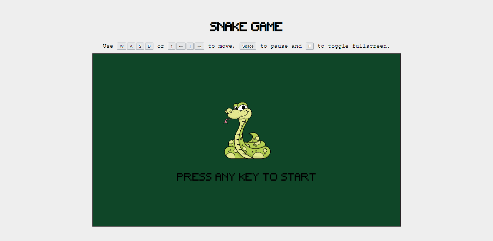
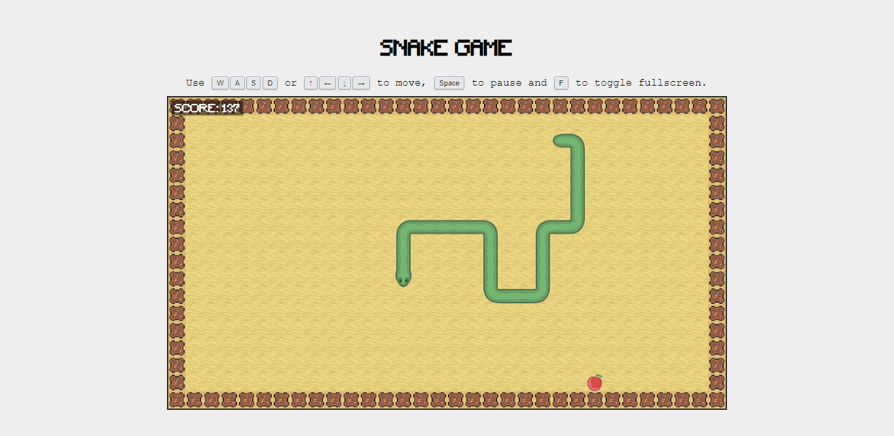

# snake-game
Just a simple snake game written on TypeScript. You can try it __*[here](https://snake-game-1.vercel.app)*__.

## Implemented
- Concept of scenes, layers, tilemaps, spritesheets, etc.
- Three scenes
  - Start screen
  - Game scene
  - Game Over screen
- Simple score system
  - Snake is speed up when eats apples. The more score the faster snake speed
  - The more snake speed the more score you earn eating apples  

